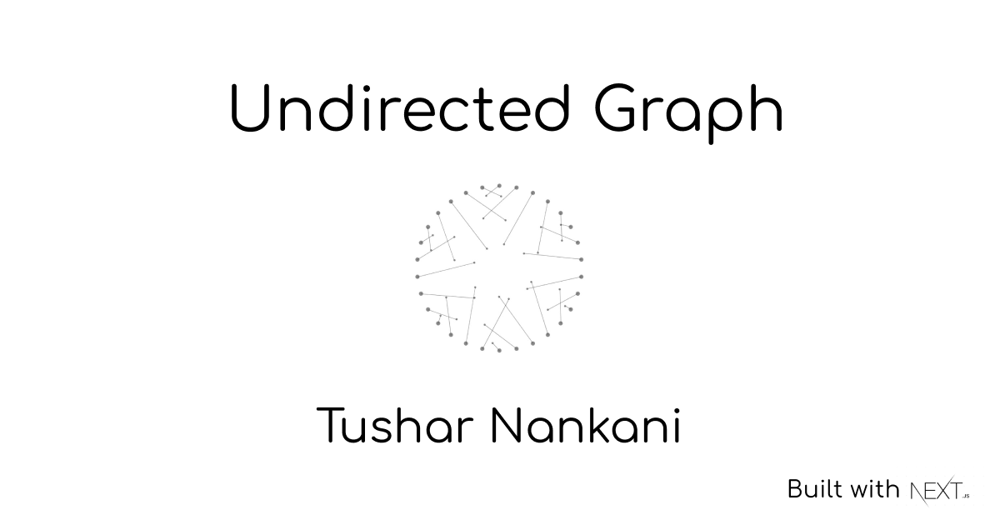

<br />
<br />


<p align="center">The overload of ideas has pushed me to connect the dots, analogous to my directionless, although somehow connected thoughts forming a data structure.</p>
<p align="center"><a href="https://undirected-graph.netlify.app">Undirected Graph</a></p>
  
<br />
<br />

[](https://app.netlify.com/sites/undirected-graph/deploys)
[](https://nextjs.org/)

<br />


## About


## Features

- **Tagging**: organizes content by tags
- **Author**: displays author names who write a post
- **Pagination**: limits the number of posts per page
- **CMS**: built with CMS to allow editors modifying content with the quickest way
- **SEO optimized**: built-in metadata like JSON-LD
- **Shortcode**: extends content writing with React component like WordPress shortcodes

## Dependencies

- [TypeScript](https://www.typescriptlang.org/)
- [Next.js](https://nextjs.org/)
- [Netlify](https://www.netlify.com/)
- [MDX](https://mdxjs.com/)

## Local Setup || Contributing

- Fork this repository. 
- Clone the repository: `git clone https://github.com/<your-username>/undirected-graph.git`
- Change directory: `cd undirected-graph`
- Change branch before making any changes: `git checkout -b "feat/add-new-feat"`
- Run `npm run dev` to start the devlopment server. Go to `localhost:3000`
- Make changes and push to the respective branch.
- Open a Pull Request.

### Styling pages by a customized theme

All source codes related to the blog are under [components](/src/components) and [pages](/src/pages) directory.
You can modify it freely if you want to apply your design theme.
All components use [styled-jsx](https://github.com/vercel/styled-jsx) and [css-modules](https://github.com/css-modules/css-modules) to define their styles, but you can choose any styling libraries for designing your theme.

The directory tree containing the blog source code are described below:

```
meta: yaml files defining metadata like authors or tags
public: images, favicons and other static assets
src
├── assets: other assets using inside of components
├── components: pieces of components consisting of pages
├── content: mdx files for each post page
├── lib: project libraries like data fetching or pagination
└── pages: page components managing by Next.js
```

## References

- A huge shoutout to [wutali/nextjs-netlify-blog-template](https://github.com/wutali/nextjs-netlify-blog-template) 
- [Netlify CMS Documentation](https://www.netlifycms.org/docs/intro/)
- [Building a Markdown blog with Next 9.4 and Netlify](https://www.netlify.com/blog/2020/05/04/building-a-markdown-blog-with-next-9.4-and-netlify/)
- [Hugo Theme - Codex](https://github.com/jakewies/hugo-theme-codex)
- [Next.js Starter Template for TypeScript](https://github.com/vercel/next-learn-starter/tree/master/typescript-final)
- [Building Blog with NextJS and Netlify CMS](https://dev.to/mefaba/building-blog-with-nextjs-and-netlify-cms-fom)
- [Unicons](https://github.com/Iconscout/unicons)

